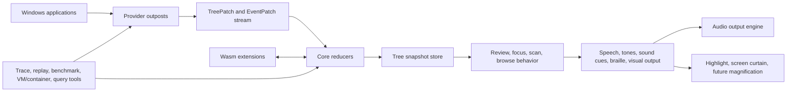

# Architecture Overview

## Goal

Verbatim is a Windows 11-only screen reader written in Rust. It is inspired by NVDA, but it is not constrained to NVDA's Python-centric process, plugin, or virtual buffer architecture.

The architecture optimizes for responsiveness, testability, crash isolation, and a deliberate path to feature parity.

The durable project goals and non-goals are recorded in `docs/superpowers/specs/2026-06-27-verbatim-rewrite-design.md`.

## System Shape

This diagram shows the reader as an event-driven system with isolated provider access.

Applications expose UIA, MSAA, IA2, and later Java Access Bridge objects and events. Verbatim consumes those APIs through outposts, normalizes provider data into internal patches, and applies those patches to a stable tree snapshot.

## Main Components

| Component | Responsibility |
|---|---|
| Core | Input dispatch, tree store, pure reducers, output planning, extension policy |
| Outpost manager | Starts, supervises, and restarts provider outposts |
| Outpost | Owns risky accessibility API calls for one application or provider scope |
| Tree store | Applies patches and exposes immutable tree revisions |
| Behavior reducers | Derive focus, review, browse, scan, and output intent from snapshots |
| Output scheduler | Interrupts, queues, prioritizes, and traces speech, tones, sound cues, braille, and visual output |
| Audio output engine | Owns audio backend selection, local WASAPI playback, remote audio routing, buffers, and device notifications |
| Visual output manager | Owns focus highlight, screen curtain, and architecture hooks for future magnification |
| Extension host | Runs sandboxed Wasm extensions with explicit capabilities |
| Native synth host | Loads controlled native DLL synthesizers outside the core |
| Remote substrate | Shared transport, capability, command, and trace primitives for VM/container tooling and user remote support |
| GUI process | Accessible wxDragon UI for settings, logs, profiles, and tools |
| Tooling | Query CLIs, fake providers, trace replay, benchmarks, CI runner/container/VM automation, parity comparison |

## Non-Negotiable Invariants

| Invariant | Enforcement |
|---|---|
| Core never waits indefinitely for a provider | IPC deadlines and outpost watchdogs |
| Provider calls do not run on input, speech, GUI, or reducer hot paths | Static architecture boundary and code review rule |
| Keyboard and output hot paths enqueue only | `docs/architecture/hot-paths.md` contract |
| Every externally observed event can be traced to output or suppression | Trace IDs and span propagation |
| Tests can run without real applications | Fake provider and trace replay harnesses |
| ARM64 is first-class | CI builds and shared latency budgets |
| Extensions do not receive raw COM access | Capability-scoped host APIs only |

## Functional Core, Imperative Shell

Verbatim should keep as much behavior as possible in pure or nearly pure code:

| Pure or deterministic layer | Imperative shell layer |
|---|---|
| Tree patch validation | COM provider calls |
| Snapshot reduction | IPC |
| Focus/review/browse state transitions | Speech/audio/visual device work |
| Output intent planning | Keyboard hooks |
| Extension permission checks | Native synth DLL loading and audio endpoint handling |
| Trace replay tests | VM orchestration |

The payoff is direct: LLMs and human developers can validate behavior from recorded traces without launching full applications.

## Relationship to NVDA

NVDA remains a key behavioral oracle and source of lessons. Verbatim should preserve or improve the user-facing concepts: speech, tones, sound cues, braille, gestures, review cursor, object navigation, browse mode, configuration profiles, localization, dictionaries, secure desktop behavior, remote support, visual focus highlighting, screen curtain, app-specific support, and later magnification.

Verbatim differs in these architectural choices:

| Area | NVDA approach | Verbatim approach |
|---|---|---|
| Extension surface | Broad Python add-ons | Minimal Wasm extension host with explicit API |
| Isolation | Mostly one process plus native helpers | Core plus outposts, extension hosts, and synth hosts |
| Performance optimization | In-process helpers and virtual buffers where needed | Outposts first, provider-side batching and injection only when measured |
| Testing | Unit and real application system tests | Pure reducer tests, fake providers, trace replay, programmatic benchmarks, GitHub runner scenarios, VM scenarios, differential parity |
