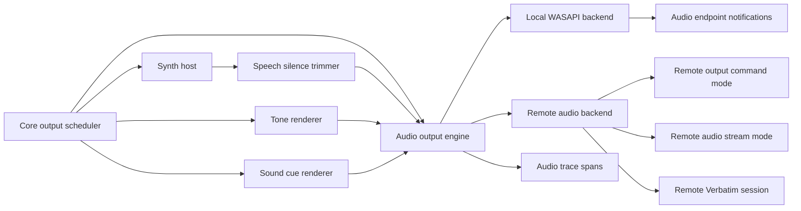

# Audio Output and Backend Handling

## Decision

Output scheduling, rendering, and audio playback are separate responsibilities.

The core decides what should be spoken, which tones or sound cues should play, and when output should be interrupted. Synth hosts turn speech requests into audio. Tone and sound-cue renderers produce non-speech audio. The audio output engine owns a pluggable backend interface for delivering that audio. The default local backend uses WASAPI; other backends can route output commands or audio frames to a remote Verbatim instance or another transport.

## Component Boundaries

This diagram shows the output-to-audio path. The audio output engine owns backend selection and the common buffer/control contract. Individual backends own their transport-specific state.

## Responsibilities

| Component | Responsibility |
|---|---|
| Core output scheduler | Priorities, interruption, output IDs, output policy, trace causality |
| Synth host | Text-to-audio rendering, native DLL isolation, synthesis timing |
| Tone renderer | Generates tones such as beeps and progress/status tones |
| Sound cue renderer | Loads and plays short sound cues |
| Speech silence trimmer | Removes leading/trailing silence from speech audio before backend enqueue |
| Audio output engine | Backend selection, shared buffer contract, playback position, stop/reset, trace correlation |
| Local WASAPI backend | WASAPI client lifecycle, endpoint changes, local render buffers, local device recovery |
| Remote backend | Output command delivery, optional audio packetization, transport health, remote acknowledgment, remote buffer state |
| Trace collector | Correlates event, synthesis, audio buffer, and playback spans |

The core must be able to interrupt speech, tones, and sound cues without waiting for rendering to finish. Interrupt commands go to the relevant renderer and the audio output engine. The audio engine drops queued buffers for interrupted output IDs and resets the stream when needed.

## Process Placement

Production playback is isolated from the core as a supervised audio output engine process. Early tests may use an in-process fake audio sink, but production backend work must not live on input, provider, GUI, or reducer hot paths.

| Mode | Use |
|---|---|
| Fake audio sink | Unit tests and trace replay |
| Spy audio sink | Parity and VM scenarios where speech, tones, and sound cues are captured as data |
| Local WASAPI backend | Real local playback and Windows device handling |
| Remote command backend | Send output commands to another Verbatim instance or remote session |
| Remote audio backend | Send audio frames to another Verbatim instance or remote session |
| Secure audio backend | Restricted secure-desktop playback path |

## Backend Contract

Every backend must implement the same high-level contract so the core and synth hosts do not depend on the delivery mechanism.

| Operation | Requirement |
|---|---|
| `open` | Prepare the backend for a selected output target |
| `enqueue` | Accept audio frames for a specific output ID |
| `send_command` | Send a structured output command when the backend supports command mode |
| `drop_output` | Discard buffered frames or commands for interrupted or superseded output |
| `flush` | Clear all queued audio |
| `set_volume` | Apply reader volume policy where supported |
| `status` | Report readiness, buffer depth, and current output target |
| `close` | Release backend resources without blocking the core |

## Local WASAPI Duties

| Duty | Requirement |
|---|---|
| Endpoint enumeration | List output devices and stable display names |
| Default device tracking | Switch or report when the default output endpoint changes |
| Device disconnection | Stop or reroute playback without blocking the core |
| Buffer management | Maintain low-latency ring buffers with underrun/overrun tracing |
| Stream reset | Drop interrupted speech quickly and recover from invalidated devices |
| Format handling | Negotiate sample format and perform conversion where needed |
| Volume/session policy | Support reader volume and future audio ducking decisions |
| Error reporting | Emit trace spans for device errors and recovery |

## Speech Processing Duties

| Duty | Requirement |
|---|---|
| Silence trimming | Remove leading and trailing silence from synthesized speech before enqueue |
| Speech metadata | Preserve utterance ID, language, voice, priority, and interruption policy |
| Non-speech separation | Do not apply speech-only trimming to tones or sound cues |
| Traceability | Emit spans for synthesis duration, silence trimming, and backend enqueue |

## Remote Output Duties

| Duty | Requirement |
|---|---|
| Peer discovery/selection | Choose a remote Verbatim endpoint or remote-session target |
| Transport health | Report connection state, round-trip time, and backpressure |
| Command mode | Send speech sequences, tone commands, sound cue IDs, priorities, and interruption metadata |
| Audio packetization | Send audio frames with output IDs, sequence numbers, and timing metadata when stream mode is selected |
| Remote buffering | Track remote buffer depth and dropped frames |
| Interruption | Send immediate drop/flush commands for interrupted output IDs |
| Fallback policy | Fall back to local output or silence according to user/security settings |
| Security | Authenticate and authorize remote peers before sending output |

## Audio Events

| Event | Meaning |
|---|---|
| `audio_device_added` | A new output endpoint appeared |
| `audio_device_removed` | An output endpoint disappeared |
| `audio_default_device_changed` | Windows default output endpoint changed |
| `audio_backend_changed` | Output switched between local, remote, fake, or secure backends |
| `audio_backend_unavailable` | Selected backend cannot currently accept audio |
| `audio_stream_started` | Backend stream started |
| `audio_stream_stopped` | Backend stream stopped |
| `audio_buffer_enqueued` | Audio frames were accepted for playback |
| `audio_buffer_dropped` | Frames were discarded due to interruption or stale utterance |
| `audio_command_sent` | Remote command-mode output was sent |
| `remote_output_acknowledged` | Remote peer acknowledged an output command or packet |
| `speech_silence_trimmed` | Leading/trailing silence was removed from synthesized speech |
| `tone_generated` | A tone was generated |
| `tone_audio_started` | Tone playback started |
| `tone_finished` | Tone playback finished or was cancelled |
| `sound_cue_loaded` | A sound cue was loaded for playback |
| `sound_cue_audio_started` | Sound cue playback started |
| `sound_cue_finished` | Sound cue playback finished or was cancelled |
| `output_finished` | Any speech, tone, sound cue, remote command, or audio output item reached a terminal state |
| `audio_underrun` | Playback needed frames that were not available |
| `audio_device_invalidated` | Current endpoint became unusable |
| `audio_recovered` | Playback resumed after reset or device switch |

## Latency and Reliability Targets

| Path | Target |
|---|---:|
| Interrupt request to queued buffers dropped | p95 under 20 ms |
| Output queued to first local audio buffer accepted | Measured from Phase 1 |
| Output queued to first remote command or audio packet accepted | Measured per transport and remote scenario |
| First audio buffer accepted to stream start | Low single-digit ms where practical |
| Local device invalidation to core notification | p95 under 100 ms |
| Remote backend interruption command sent | p95 under 20 ms after interrupt request |
| Device recovery after default-device switch | Tracked per VM scenario |

The p95 under 20 ms cacheable-focus-event-to-speech-audio-started budget is a core responsiveness target. Audio spans are part of that budget, so developers can see speech planning, synthesis or cached audio selection, silence trimming, buffer enqueue, and playback start.

## Phase Placement

| Phase | Audio work |
|---|---|
| Phase 0 | Backend trait/IPC contract plus local WASAPI spike for endpoint enumeration, render-buffer playback, and device notifications |
| Phase 1 | Fake and spy sinks for speech, tones, and sound cues plus audio trace spans in core tests |
| Phase 2 | Minimal real WASAPI playback for shell-reader usage |
| Phase 4 | Synth host foundation streams audio into the audio engine |
| Phase 7 | GUI exposes output device/backend selection and diagnostic status |
| Phase 8 | Remote command and audio backends route output to another Verbatim instance or remote session |
| Secure desktop work | Restricted audio engine path with trusted synth/output configuration |

## Acceptance Criteria

| Requirement | Check |
|---|---|
| Audio backend switches are observable | Backend switch test and trace artifact |
| Local audio device changes are observable | Device notification test and trace artifact |
| Interrupted output drops queued buffers or commands quickly | Audio sink test with trace evidence |
| Speech silence trimming is measurable | Synth output fixture with trace evidence |
| Tones and sound cues use the same backend path | Tone/cue output fixture with trace evidence |
| Backend errors do not block core input | Fault-injection, transport-failure, or device-removal test |
| Synth host output does not bypass audio tracing | Phase 4 synth integration test |
| Native synth output does not bypass audio tracing | Phase 5 synth integration test |
| VM scenarios collect audio status | VM artifact includes audio spans and device state |
