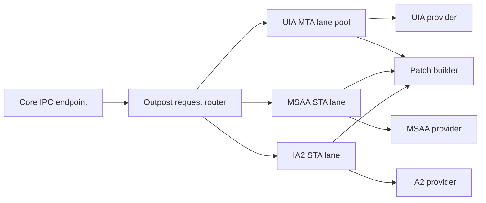

# COM Apartment and Threading Model

## Decision

COM access is isolated to outposts. Each outpost uses explicit COM apartments and call lanes appropriate to the provider API. The core process avoids arbitrary provider COM calls.

## Apartment Layout

| Location | Apartment | Purpose |
|---|---|---|
| Core process | No provider COM by default; dedicated MTA utility thread only if unavoidable | Core responsiveness |
| wxDragon GUI thread | STA | GUI toolkit message pump |
| UIA outpost lanes | MTA | UIA event handling and provider queries |
| MSAA outpost lanes | STA with message pump | Legacy IAccessible providers |
| IA2 outpost lanes | STA with message pump by default | IA2 is layered on COM and MSAA-style access |
| Native synth host | API-specific | Depends on synth driver; isolated from core |

Each COM thread calls `CoInitializeEx` with the intended apartment model. Apartment choice must be visible in code names, tests, and trace metadata.

Each outpost initializes COM security deliberately before provider work begins. The chosen `CoInitializeSecurity` settings, impersonation level, and failure behavior must be documented in code and trace metadata. Outposts must not rely on accidental process defaults established by a library.

## Cross-Apartment Rules

| Rule | Rationale |
|---|---|
| Never send raw COM interface pointers to the core | The core owns normalized IDs and snapshots, not provider objects |
| Marshal COM pointers explicitly inside an outpost | Avoid accidental cross-apartment misuse |
| Keep provider object identity local to outposts | Enables outpost restart and cache invalidation |
| Represent objects to the core as stable Verbatim node IDs | Decouples behavior from provider lifetime |

Inside an outpost, cross-apartment COM references must use explicit marshaling such as COM streams or the Global Interface Table. Raw interface pointers must not be copied between lanes. Provider references that survive across calls are owned by one lane or marshaled through an explicit owner.

## Call Lanes

This diagram shows an outpost with separate call lanes for provider families.

Lane count starts conservative. Add lanes only after traces show a need and prove provider safety.

STA lanes own their message pump. They must not hold global locks while pumping messages, and they must treat COM reentrancy as possible. Any reentrant callback must enqueue work or update lane-local state rather than calling back into the core synchronously.

When a lane exceeds a request deadline, the core stops waiting. If a lane exceeds its health deadline or stops pumping, the outpost is marked unhealthy and abandoned or restarted. The design does not depend on forcibly cancelling an in-flight COM call.

## Deadlines, Cancellation, and Watchdogs

Provider calls have two time limits:

| Limit | Meaning |
|---|---|
| Request deadline | The core stops waiting for an answer and continues |
| Health deadline | The outpost manager decides the outpost is unhealthy |

Cancellation is best effort. Many blocking COM or provider calls cannot be reliably interrupted. Therefore, process-level recovery is the safety boundary.

## Responsiveness Budget

| Path | Target |
|---|---:|
| Keypress to command dispatch | p95 under 10 ms |
| Interrupt request to old speech stopped | p95 under 20 ms |
| Cacheable focus event observed to speech audio started | p95 under 20 ms on x64 and ARM64 |
| Interactive provider query deadline | 50 to 150 ms, chosen per operation |
| Outpost heartbeat interval | 250 ms initial value |
| Outpost unhealthy threshold | Two missed health periods or one expired critical operation |

These numbers are starting budgets. They may tighten after measurement, but they must not split into lower x64 and higher ARM64 targets.

## Event Subscription Policy

| Provider family | Subscription approach |
|---|---|
| UIA | Outpost registers UIA event handlers on MTA lanes where possible |
| MSAA | Outpost receives WinEvents and resolves objects on STA lanes |
| IA2 | Outpost combines WinEvents/custom IA2 events with IA2 interface queries |
| Java Access Bridge | Deferred until Phase 12; must follow the same outpost isolation rule |

UIA cache requests and UIA Remote Operations are optimization tools, not separate trust boundaries. Use UIA cache requests for bulk property/pattern collection when they reduce round trips. Use Remote Operations only after traces show a bottleneck, and keep results normalized through the same TreePatch path.

## Testing Requirements

| Test | Purpose |
|---|---|
| COM apartment smoke test | Verifies lanes initialize with expected apartment model |
| COM security initialization test | Verifies outpost COM security is initialized before provider work |
| Cross-apartment misuse test | Ensures raw provider references do not escape outpost boundaries |
| STA reentrancy test | Ensures STA callbacks do not synchronously call into core or hold global locks |
| Hung provider test | Simulates a COM call that never returns |
| Timeout trace test | Verifies timeout, stale snapshot use, and outpost health events |
| UIA cache/Remote Operations benchmark | Measures whether batching improves terminal or text traversal scenarios |
| ARM64 build test | Ensures COM abstractions compile for Windows ARM64 |
