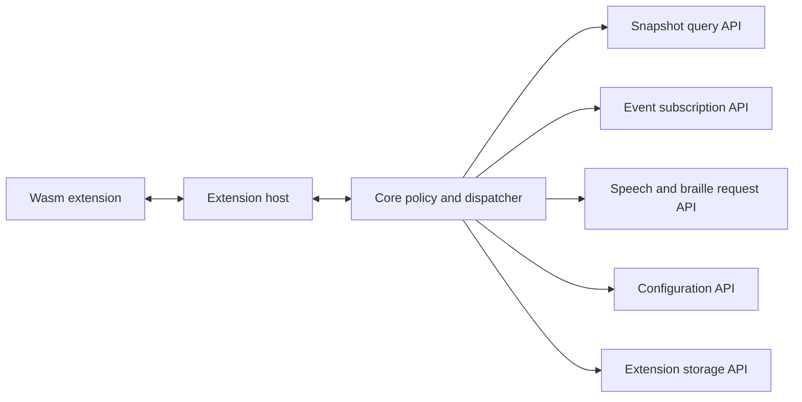

# Extensions and Speech Synthesizers

## Decision

Verbatim replaces NVDA's broad Python add-on surface with a minimal, sandboxed Wasm extension system. Extensions are the rewrite's term for app modules and other add-on behaviors. Speech synthesizers use the same policy principle, but latency-sensitive native synths run in dedicated synth host processes rather than general Wasm extension hosts.

## Extension Host Model

This diagram shows the extension boundary. Extensions operate on snapshots and host APIs, not raw COM.

## Extension Types

| Type | Purpose | Earliest phase |
|---|---|---|
| App extension | Application-specific support for Office, Terminal, browsers, and other apps | Phase 4 |
| Global extension | Cross-application command or behavior | Phase 4 |
| Speech extension | Synthesizer support where pure Wasm is adequate | Phase 5 |
| Native synth extension | Controlled native DLL support | Phase 5 |
| OCR extension | Requests OCR for focused object, region, or current window | Phase 9 |
| AI recognition extension | Requests synthetic accessibility trees | Phase 10 |
| Braille extension | Braille display support | Phase 13 |

## Host API Principles

| Principle | Consequence |
|---|---|
| Start minimal | Add APIs only when a real port or built-in feature needs them |
| Capability-scoped | Extensions declare required permissions |
| Snapshot-based | Extensions query tree revisions rather than live providers |
| Async and deadline-bound | Extension calls cannot block core responsiveness |
| Traceable | Extension decisions and output requests carry trace IDs |
| Versioned | Host API compatibility is explicit |
| Secure-desktop aware | Extensions are denied on secure desktops unless explicitly allowlisted with reduced capabilities |

## Wasm Sandbox Contract

Capability checks are necessary but not sufficient. Extension hosts must also enforce resource and environment limits.

| Area | Requirement |
|---|---|
| WASI defaults | Filesystem, environment, clocks beyond approved APIs, process launch, and network are denied by default |
| Memory | Each extension has a configured maximum linear memory and host-side buffer quota |
| Fuel or instruction budget | Long-running calls are preempted by fuel, epoch interruption, or equivalent runtime support |
| Wall-clock deadlines | Host API calls and extension callbacks carry deadlines and cancellation tokens |
| Storage quota | Extension storage is namespaced, quota-limited, and clearable per extension |
| Capability revocation | Capability grants can be revoked on update, profile change, secure desktop entry, or policy change |
| Crash containment | Extension traps, memory exhaustion, or runtime crashes unload that extension without crashing the core |
| Network | Network is denied unless a future explicit capability and review process allow a narrow case |
| Observability | Timeout, trap, quota, deny, and revocation decisions are traceable |

## Initial Host APIs

| API | Capability |
|---|---|
| `tree.query` | Read selected fields for nodes in a snapshot |
| `tree.subscribe` | Subscribe to focus, subtree, text, or app-scope events |
| `output.speech.request` | Request speech with priority and trace cause |
| `output.tone.request` | Request a generated tone with priority and trace cause |
| `output.soundCue.request` | Request a named sound cue with priority and trace cause |
| `output.braille.request` | Request braille output, initially a no-op sink until braille phase |
| `config.read` | Read allowed configuration keys |
| `config.write` | Write extension-owned configuration |
| `storage.get/set/delete` | Extension-specific storage |

## Later Recognition Host APIs

These APIs are not part of the initial extension surface. They are introduced only in the recognition phases that need them.

| API | Phase | Capability |
|---|---:|---|
| `ocr.request` | Phase 9 brokered OCR request for focused object, region, or current window |
| `ocr.rerun` | Phase 9 request to rerun OCR for a previously recognized target |
| `ocrModel.register` | Phase 9 extension-contributed OCR model registration |
| `aiRecognition.request` | Phase 10 request to synthesize an accessibility tree |
| `aiRecognition.rerun` | Phase 10 request to rerun AI recognition for a changed target |
| `aiModel.register` | Phase 10 extension-contributed AI recognition model registration |

## Speech Synthesizer Model

Speech latency is core behavior. The core schedules speech and interruptions; synth hosts render audio; the audio output engine owns backend selection, buffers, local WASAPI playback, remote audio routing, and device state. The minimal isolated synth-host IPC path exists by Phase 2 for OneCore; Phase 4 adds the extension-facing synth-provider contract, and Phase 5 adds more synthesizers.

OneCore is the first real synthesizer target. SAPI5 and eSpeak are later Phase 5 synthesizer expansion targets. Controlled native DLL synthesizer support also belongs in Phase 5 and must remain generic in the architecture; individual closed-source synths are proof cases, not architectural dependencies.

| Synth type | Process | Notes |
|---|---|---|
| Built-in simple synth or test synth | Core or test process only for early harnesses | Used for deterministic tests |
| OneCore | Dedicated or shared synth host | First real target |
| SAPI5 | Dedicated or shared synth host | Phase 5 expansion target |
| eSpeak | Dedicated or shared synth host | Phase 5 expansion target with multilingual validation |
| Pure Wasm synth | Wasm synth host | Safe but must meet latency targets |
| Native synth DLL | Dedicated native synth host | Required for closed-source DLLs |
| Native DLL proof path | Dedicated native synth host | Load controlled DLL outside core |

Native synth DLLs must not load into the core process. ARM64 requires at least one native ARM64 synth path. If a required synth DLL is x64-only, the ARM64 core may communicate with an x64-emulated synth host only as an optional compatibility bridge, and only if separate latency benchmarks show it meets the same target.

## Acceptance Criteria

| Requirement | Check |
|---|---|
| Extension cannot access raw COM | API boundary test |
| Hung extension cannot block input or speech interruption | Host timeout test |
| Native synth crash does not crash core | Synth host crash test |
| Native DLL synth path can be measured end to end | Phase 5 proof trace |
| ARM64 has native synth coverage | Native ARM64 synth benchmark |
| x64-emulated synth bridge is not assumed | Separate optional compatibility benchmark |
| Extension output is observable | Trace includes extension span and speech cause |
