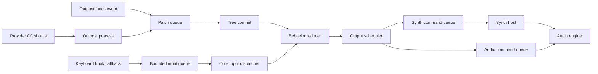

# Hot Path and Latency Contract

## Decision

Keyboard input, speech interruption, focus-event handling, output scheduling, and trace emission have explicit hot-path rules. These paths must remain bounded even when an application provider, outpost, extension, synth host, audio backend, GUI, disk, or trace sink is slow or hung.

This contract is the implementation boundary for the p95 under 20 ms cacheable-focus-event-observed-to-speech-audio-started target.

## Hot Path Shape

This diagram shows which work is allowed on latency-sensitive paths. Risky or slow work is pushed behind queues, deadlines, or isolated processes.

## Keyboard Hook Rules

| Rule | Requirement |
|---|---|
| Enqueue only | The hook callback timestamps, copies minimal key data, enqueues to a bounded queue, and returns |
| No provider access | No UIA, MSAA, IA2, Java Access Bridge, window text, or provider-derived query runs on the hook callback |
| No synchronous IPC | The hook callback does not wait for outposts, extensions, synths, audio, GUI, trace collector, or remote peers |
| No GUI calls | The hook callback does not call wxDragon or other GUI APIs |
| No synth or audio work | The hook callback does not synthesize speech, render tones, load sound cues, or wait for device state |
| No blocking logging | Logging and tracing use non-blocking buffers or atomics; overflow is loss-visible |
| No unbounded allocation | Preallocate or use bounded structures; allocation failures degrade to dropped/coalesced diagnostics |
| No long-held locks | Locks are avoided; if unavoidable, they must be try-only or bounded and never held across callbacks |

## Core Dispatch Rules

| Operation | Rule |
|---|---|
| Input dispatch | Reads current immutable snapshot and command bindings; never waits for provider refresh |
| Focus-event reducer | Uses the committed patch and cached data; missing provider details become stale/unknown metadata |
| Speech planning | Produces an output intent and interruption decision without waiting for synthesis |
| Output scheduling | Enqueues speech, tone, sound-cue, braille, visual, remote, or audio commands without waiting for completion |
| Extensions | Extension calls are asynchronous, deadline-bound, and cannot block core input or speech interruption |
| Tracing | Trace emission is buffered, low overhead, and records dropped spans or counters when overloaded |

## Latency Budgets

| Path | Target |
|---|---:|
| Keypress to command dispatch | p95 under 10 ms |
| Interrupt request to old speech stopped | p95 under 20 ms |
| Cacheable focus event observed to speech audio started | p95 under 20 ms on x64 and ARM64 |
| Hook callback execution | Kept as short as practical and measured separately |
| Blocking operation on any hot path | Not allowed |

## Failure Behavior

| Failure | Required behavior |
|---|---|
| Input queue full | Drop or coalesce according to input policy and increment a loss-visible counter |
| Trace buffer full | Drop trace spans, increment counters, and emit a later loss summary |
| Outpost unavailable | Use cached snapshot and provider health metadata |
| Extension slow or hung | Timeout or skip extension result; input and speech interruption continue |
| Synth host slow or hung | Interrupt, restart, switch synth, or speak fallback according to output policy |
| Audio backend unavailable | Report backend state, switch if configured, and keep input responsive |

## Tests and Benchmarks

| Check | Purpose |
|---|---|
| Hung provider input test | Keyboard commands continue while a provider call blocks forever |
| Hung outpost IPC test | Input dispatch does not wait on synchronous outpost replies |
| Blocked trace sink test | Input and output continue when the trace collector is stalled |
| Blocked GUI test | Keyboard commands do not require GUI responsiveness |
| Queue overflow test | Drops/coalescing are observable and bounded |
| Focus-to-speech-start benchmark | Measures event observed, tree commit, output queued, audio buffer accepted, and speech audio started |
