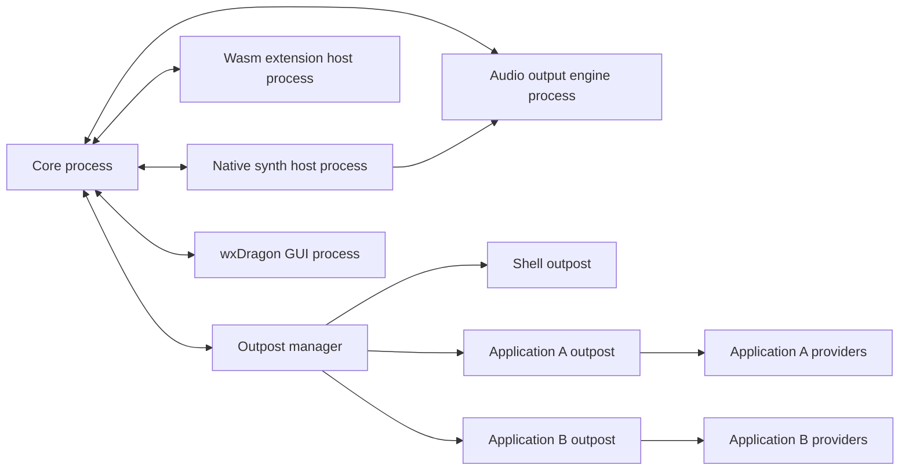
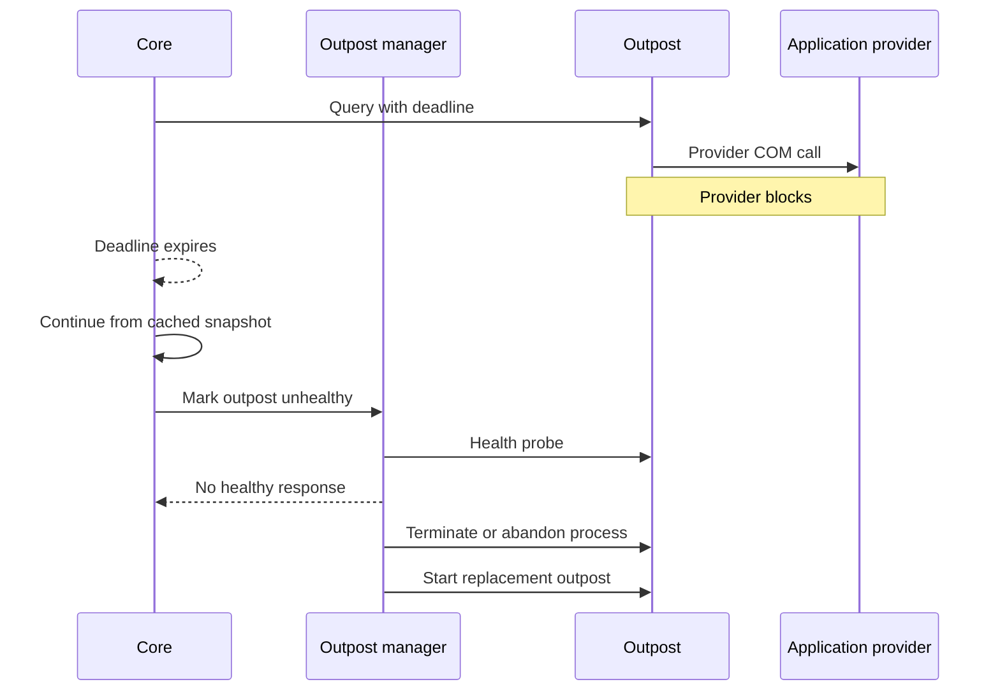

# Process Model and Crash Isolation

## Decision

Verbatim uses a multi-process model. The core process is small and responsive. Accessibility API calls into applications run in outpost processes. Extensions, native speech synthesizers, and production audio playback run outside the core in supervised processes. Early deterministic tests may use in-process fake sinks, but production provider, synth, extension, and audio backend work does not run in the core process.

This is required because a blocking Windows API or COM provider call can compromise the process that issued it. Threads alone are not a sufficient isolation boundary.

## Process Topology

This diagram shows isolation boundaries. A failure in an outpost, native synth host, or audio output engine must not take down the core.

## Outpost Scope

The default scope is one logical outpost per application. Some applications require more granular provider scopes.

Outpost scope may become more granular than one process per application. Browser, Electron, Office, terminal, or embedded-provider scenarios should split into separate outpost processes when a provider PID, document, tab, renderer, or plugin can hang independently and degrade the rest of the application scope.

| Case | Recommended outpost scope |
|---|---|
| Explorer, Settings, shell UI | Dedicated shell outpost |
| Simple desktop application | One outpost per process |
| Browser or Electron app | Start with one logical app outpost, then shard to provider-PID, tab, document, or renderer-process outposts when traces show independent hang or latency domains |
| Windows Terminal | Dedicated app outpost with UIA throttling and Remote Operations experiments |
| Secure desktop | Separate hardened secure-desktop instance and restricted outpost set |

## Core Responsibilities

The core owns:

| Responsibility | Notes |
|---|---|
| Input dispatch | Must continue even when an outpost hangs |
| Tree snapshot store | Applies validated patches from outposts |
| Behavior reducers | Focus, review, browse, scan, and output planning |
| Output scheduling | Interrupt and queue decisions for speech, tones, sound cues, braille, and visual output are core-critical |
| Extension policy | Capability checks and extension lifecycle |
| Trace correlation | End-to-end IDs across outposts, extensions, synths, and audio |

The core must not directly call arbitrary application UIA, MSAA, IA2, or Java Access Bridge providers.

The input and output hot-path rules are specified in `docs/architecture/hot-paths.md`. In particular, keyboard hooks enqueue only and do not wait for providers, outposts, extensions, synths, audio, GUI, remote peers, or trace sinks.

## Outpost Responsibilities

An outpost owns:

| Responsibility | Notes |
|---|---|
| Provider subscriptions | UIA events, WinEvents, IA2 events where supported |
| Provider queries | Role, name, state, text, patterns, relations, actions |
| Query deadlines | Enforced at IPC request boundaries |
| Coalescing and throttling | Especially for terminals and large documents |
| Patch production | Emits normalized patches to the core |
| Local provider cache | Avoids repeated expensive calls |
| Health reporting | Heartbeat, call-lane status, provider latency stats |

## Watchdog Model

This diagram shows how the core handles slow or hung outposts.

Per-call cancellation is a best effort. If the call cannot be interrupted, Verbatim abandons the outpost process and restarts its provider state. The core remains responsive throughout.

## IPC Policy

| IPC stream | Direction | Characteristics |
|---|---|---|
| Control requests | Core to outpost | Deadline-bound, request-response |
| Patch stream | Outpost to core | Ordered, revisioned, backpressure-aware |
| Health stream | Outpost to manager | Heartbeats and lane status |
| Trace stream | All processes to collector | Buffered, loss-visible, low overhead |
| Speech stream | Core to synth host | Low-latency synthesis command and render status |
| Output command stream | Core to audio engine or remote backend | Tones, sound cues, interruption, and remote output commands |
| Audio stream | Synth host and renderers to audio engine | PCM packets, buffer status, and playback position |
| Audio control | Core to audio engine | Stop, pause, device selection, volume, and stream reset |

IPC messages must be structured, versioned, and traceable. Do not expose COM pointers or provider-native object handles across the core boundary.

## Native Helpers and Injection

NVDA uses native helper code and in-process techniques for high-volume access paths. Verbatim should learn from that design, but not make injection the first dependency.

| Technique | Use in Verbatim |
|---|---|
| UIA Remote Operations | Early measured optimization for terminals and text traversal |
| In-process helper DLLs | Late optimization only after fake-provider and VM traces prove need |
| Provider-side batching | Preferred before broad injection |
| Core-process native DLL loading | Avoid for app providers and third-party synths |

## Acceptance Criteria

| Requirement | Check |
|---|---|
| A hung provider cannot block core input | Hang fixture test |
| Keyboard hook does not wait on IPC, GUI, logging, synth, or audio | Hot-path benchmark and fault-injection tests |
| A hung outpost can be restarted | Watchdog integration test |
| Core speaks from cached state after a provider timeout | Trace replay and VM scenario |
| Outpost failure is visible in diagnostics | Trace and health report |
| x64 and ARM64 builds include the same process model | CI build checks |
