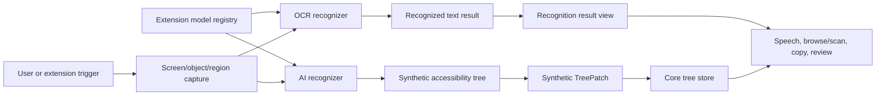

# Recognition: OCR and AI Synthetic Trees

## Decision

OCR and AI recognition are related but separate capabilities and should be implemented in separate later phases.

OCR recognition reads text from the focused object, a chosen region, or the current window. It should support rerunning recognition when the relevant screen region updates so changed text can be read.

AI recognition synthesizes accessibility structure from pixels or screenshots. It can create a synthetic accessibility tree with roles, names, bounds, relations, confidence, and provenance. It must also support rerunning recognition when screen contents change.

Neither capability is part of the initial reader milestones.

## Recognition Pipeline

This diagram shows the shared recognition pipeline. OCR and AI use the same capture, provenance, update, and trace concepts, but produce different outputs.

## OCR Capability

| Capability | Requirement |
|---|---|
| Current object OCR | Recognize text within the focused object's bounds |
| Region OCR | Recognize text within a selected screen region |
| Window OCR | Recognize text within the current window |
| Rerun on update | Re-capture and re-recognize when the relevant screen region changes |
| Extension-contributed models | Extensions can register OCR models/providers with explicit capabilities |
| Result navigation | Present recognized text through review/browse-style navigation |
| Traceability | Capture, recognition, result, rerun, and output spans are linked |

## AI Synthetic Tree Capability

| Capability | Requirement |
|---|---|
| Synthetic tree generation | Produce nodes with role, name, bounds, relations, confidence, and provenance |
| Rerun on update | Re-recognize when screen contents change and produce incremental synthetic patches |
| Extension-contributed models | Extensions can register AI recognition models/providers with explicit capabilities |
| Provider merge | Merge synthetic nodes with provider nodes without hiding provenance |
| Confidence policy | Expose uncertain nodes as synthetic/low-confidence, not provider truth |
| Navigation | Allow review/scan navigation through synthetic nodes |
| Traceability | Link source capture, model call, synthetic patch, and output |

## Extension-Contributed Models

| Requirement | Policy |
|---|---|
| Registration | Models are registered through phase-specific OCR or AI recognition APIs |
| Capability grants | Model extensions require explicit recognition permissions |
| Isolation | Local model code runs outside the core, using the extension host or a model worker |
| Provenance | Results include model identity, version, confidence, and extension identity |
| Update support | Model providers must support cancellation and rerun requests |
| Secure desktop | Recognition model extensions are denied on secure desktops by default |
| Observability | Model load, invocation, cancellation, rerun, and result spans are traceable |

## Update Detection

| Source | Use |
|---|---|
| Provider events | Invalidate recognition when focused object/window changes |
| Screen bounds changes | Invalidate when target geometry changes |
| Pixel change detection | Rerun recognition when the captured region visibly changes |
| User command | Force rerun recognition |
| Extension request | Request rerun within granted capability |

## Security and Privacy

| Rule | Reason |
|---|---|
| Recognition is off by default on secure desktops | Avoid sending or storing sensitive pixels/text |
| Secure-desktop recognition requires explicit future policy | Prevent accidental password or UAC content exposure |
| AI/network recognition is denied on secure desktops by default | Matches secure extension policy |
| Captures and model outputs are traceable and redacted where needed | Debugging without leaking sensitive content |

## Phase Placement

| Phase | Scope |
|---|---|
| Phase 9 | OCR recognition, current object/region/window, rerun on update |
| Phase 10 | AI synthetic tree recognition, rerun on update, synthetic tree patches |
