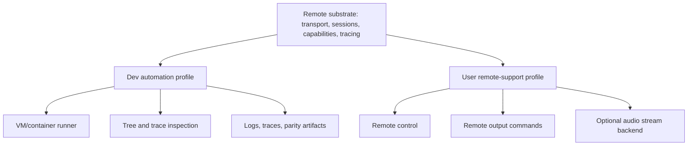

# Remote Substrate and Profiles

## Decision

Remote support and VM/container developer automation should share the same low-level primitives, but they must remain separate profiles with different trust models and capabilities.

The shared remote substrate provides transport/session framing, version negotiation, heartbeat, reconnect, capability checks, command envelopes, and trace propagation. The dev automation profile can use powerful inspection and artifact collection features in trusted labs. The user remote-support profile is narrower, consent-driven, and privacy-oriented.

Phase 0 introduces only a dev automation minimum protocol for VM/container scenarios. Phase 8 hardens the same primitives for user-facing remote support with pairing, consent, profile separation, security review, and product recovery behavior.

## Shared Substrate

This diagram shows the split between shared primitives and profile-specific features.

## Shared Primitives

| Primitive | Used by dev automation | Used by user remote support |
|---|---:|---:|
| Transport/session framing | Yes | Yes |
| Version negotiation | Yes | Yes |
| Heartbeat and reconnect | Yes | Yes |
| Capability grants | Yes | Yes |
| Trace ID propagation | Yes | Yes |
| Structured command envelope | Yes | Yes |
| Output command protocol | Yes | Yes |
| Tree and provider diagnostics | Yes | No by default |
| Artifact collection | Yes | No by default |
| User pairing and consent UI | No | Yes |

## Profiles

| Profile | Trust model | Allowed data |
|---|---|---|
| Dev automation | Explicit trusted lab, VM, or container environment | Full traces, tree snapshots, provider diagnostics, logs, artifacts |
| User remote support | Explicit user pairing, consent, and narrow permissions | Commands, selected control events, speech/tones/cues, minimal diagnostics |
| Secure desktop | Special restricted policy | No normal remote control; limited output only if explicitly allowed later |

## Remote Output Modes

The preferred low-latency path is command mode. It sends output intent to the remote Verbatim instance and lets that instance synthesize or play locally.

| Mode | What crosses the connection | Primary use |
|---|---|---|
| Output command mode | Speech sequence, tone command, sound cue ID, priority, interruption metadata | Default for latency and low bandwidth |
| Audio stream mode | Encoded or PCM audio frames with output IDs | Exact audio preservation or synth mismatch |
| Hybrid mode | Commands for speech and cues, audio frames for selected sources | Advanced scenarios after basic remote support |

Output command mode should not require the full normalized accessibility tree to be sent.

## Dev Automation Use

VM and container tooling should use the remote substrate from Phase 0. This creates early pressure on versioning, reconnects, capabilities, trace propagation, and artifact collection while avoiding premature commitment to user-facing remote support UX.

| Dev command | Purpose |
|---|---|
| `inspect_tree` | Pull a tree snapshot from the VM/container instance |
| `start_trace` | Start trace collection with a trace profile |
| `stop_trace` | Stop trace collection and finalize artifacts |
| `run_scenario` | Execute a named scenario |
| `collect_artifacts` | Pull traces, logs, parity summaries, and latency reports |
| `inject_input` | Send controlled test input |

## User Remote Support Use

User remote support becomes Phase 8. It hardens the shared substrate for product use and must not inherit dev automation powers.

| Area | Requirement |
|---|---|
| Pairing and trust | Explicit user consent, authentication, and revocation |
| Transport | Direct and relay-friendly protocol design |
| Input forwarding | Remote gestures can be sent with trace IDs and clear authority |
| Output routing | Choose local output, remote command mode, remote audio mode, or both |
| Latency | Measure command transit, remote queueing, synthesis, and playback |
| Security | Do not expose secure desktop output or privileged control without explicit secure policy |
| Recovery | Reconnect without corrupting input state or output queues |
| Observability | Remote spans preserve trace causality across machines |

## Acceptance Criteria

| Requirement | Check |
|---|---|
| VM/container tooling uses the substrate | Phase 0 dev automation scenario |
| Dev profile can collect tree and trace artifacts | Artifact collection test |
| User profile can speak remotely in command mode | Two-instance or VM scenario |
| Command mode can play tones and sound cues remotely | Remote output scenario |
| Audio stream mode is available as an audio backend | Backend switch and stream trace |
| Remote interruption is fast | p95 under 20 ms from local interrupt to remote drop command sent |
| Profiles enforce different capabilities | Dev-only tree export denied under user profile |
| Secure desktop is protected | Secure mode test proves remote output/control policy is enforced |
