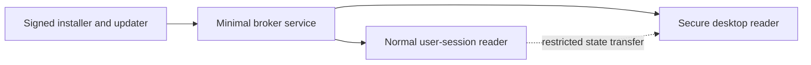

# Secure Desktop and Service Constraints

## Decision

Secure desktop support uses a separate hardened Verbatim instance with a minimal trusted feature set. The normal user-session reader and normal extension host are not reused wholesale on secure desktop.

Wasm extensions are denied by default on secure desktops, but can be explicitly enabled per extension. Secure-desktop extension enablement uses a separate allowlist and stricter capability policy than the normal desktop.

Session 0 and service behavior are treated as security-sensitive. A service may broker launch and update operations, but it must not become the interactive reader.

## Secure Desktop Topology

This diagram shows separation between normal user mode, service broker, and secure desktop mode.

## Secure Mode Policy

| Area | Policy |
|---|---|
| Built-in extensions | Trusted built-ins may run if marked secure-desktop safe |
| Wasm user extensions | Denied by default; explicit per-extension secure-desktop allowlist required |
| Extension capabilities | Reduced secure capability set; no raw provider access, network, AI, or broad storage by default |
| Native synths | Allowlist only; prefer built-in safe synth initially |
| Network and AI | Disabled |
| Logging | Minimal, redacted, opt-in debug path only |
| Configuration | Separate secure profile with controlled import and secure extension allowlist |
| IPC | Strict ACLs, session validation, desktop validation |
| Updates | Signed, atomic, rollback-capable |

## Launch and Trust Mechanics

Secure desktop support depends on Windows-specific launch and trust rules. The exact implementation must be validated in Phase 2 before broader secure-desktop functionality is added.

| Step | Requirement |
|---|---|
| Installed binaries | Secure-mode binaries are signed, installed in a protected location, and updated atomically |
| Service role | The service runs in Session 0 only as a broker for install, update, launch, and health; it is not an interactive reader |
| Token use | Launch uses the correct session/user token or secure-desktop launch mechanism; broad impersonation is avoided |
| Desktop attachment | The secure reader validates the expected window station and desktop before accepting work |
| UIAccess/signing | UIAccess, signing, and install-location requirements are documented and tested before relying on secure input or foreground access |
| IPC ACLs | Named pipes, ALPC, or other IPC endpoints restrict callers by session, integrity, service SID, and expected binary identity where possible |
| State transfer | Only restricted, redacted state crosses from normal desktop to secure desktop |
| Failure mode | If validation fails, secure mode starts with the minimal built-in profile or refuses to run rather than falling back to normal user state |

## Secure Extension Policy

| Requirement | Policy |
|---|---|
| Enablement | User or administrator must explicitly enable the extension for secure desktops |
| Identity | Extension package identity, version, and hash are pinned in the secure profile |
| Capabilities | Secure-desktop capability grants are separate from normal desktop grants |
| Storage | Extension storage is separate or read-only unless explicitly allowed |
| Output | Speech, tones, sound cues, and braille requests are allowed only through normal output policy |
| Tree access | Snapshot queries are restricted to secure desktop scope |
| Network and AI | Denied unless a future secure policy explicitly allows a narrow case |
| Audit | Extension load, deny, permission, and output decisions are traceable with redaction |

## Service Responsibilities

| Responsibility | Allowed |
|---|---|
| Install/update orchestration | Yes |
| Launch correct-session reader | Yes |
| Launch secure desktop helper | Yes |
| Hold elevated long-running UI | No |
| Load secure-allowlisted Wasm extensions | Yes, only in the secure desktop helper |
| Load normal user extensions by default | No |
| Perform provider tree queries for normal apps | No |

## Threats to Address

| Threat | Mitigation |
|---|---|
| Untrusted extension reads secure text | Deny by default; only explicit secure-allowlisted extensions get restricted snapshot access |
| Normal profile leaks into secure desktop | Separate secure profile and allowlist import |
| Logs capture passwords | Redacted logging and secure logging disabled by default |
| Low-integrity process sends fake IPC | Pipe/ALPC ACLs and caller validation |
| Broken update replaces trusted binary | Code signing and rollback |
| Native synth DLL compromises secure mode | Allowlist and separate host process |

## Acceptance Criteria

| Requirement | Check |
|---|---|
| Secure desktop can speak basic focus changes | VM secure desktop smoke test |
| Non-allowlisted user extensions are not loaded | Secure mode trace and policy test |
| Secure-allowlisted Wasm extension can load | Secure extension allowlist integration test |
| Secure extension capabilities are reduced | Permission-denial test for network, AI, broad storage, and out-of-scope tree access |
| Logs do not contain secure text by default | VM artifact scan |
| Service cannot be used as broad query proxy | IPC authorization test |
| Secure launch validates session and desktop | VM secure desktop launch test |
| Secure IPC rejects wrong-session callers | IPC ACL and caller-validation test |
| Update path can roll back | Installer integration test |
