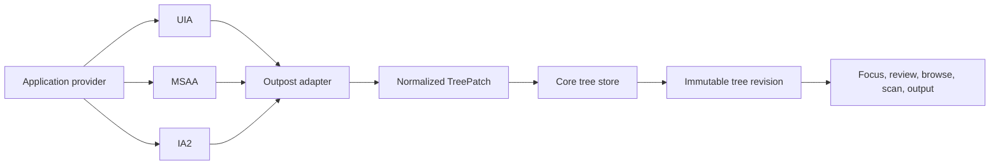

# Accessibility Tree Model

## Decision

Verbatim maintains its own normalized accessibility tree. Outposts consume UIA, MSAA, IA2, and later Java Access Bridge APIs, then emit normalized patches into the core.

AccessKit is useful as inspiration for stable node IDs, incremental updates, atomic tree snapshots, and a clean normalized representation. Verbatim applies those ideas on the screen-reader side after consuming Windows accessibility APIs.

## Consumer Boundary

This diagram shows the boundary between provider APIs and Verbatim's internal tree.

## Node Identity

| Concept | Description |
|---|---|
| Provider identity | Outpost-local handle or key for a UIA/MSAA/IA2 object |
| Verbatim node ID | Stable ID exposed to core reducers and extensions |
| Tree revision | Monotonic revision number after each committed patch |
| Provenance | Source API, process ID, window handle where available, provider hints |

Provider identity can disappear when an outpost restarts. Verbatim node IDs should remain stable when the same logical object can be reidentified.

## Node ID Reconciliation

Verbatim node IDs are opaque outside the tree store, but their lifecycle rules are explicit.

| Rule | Requirement |
|---|---|
| Scope component | IDs include an internal outpost scope or provider-domain component so two providers cannot collide |
| Logical key | IDs are derived from the best available stable provider identity, role/name/bounds/text anchors, runtime IDs, or document offsets depending on backend |
| Generation | IDs carry an internal generation so a reused provider handle cannot silently mean the old node |
| Tombstone | Removed or untrusted nodes become tombstoned for a bounded period so stale snapshots and extensions can report graceful failure |
| Reidentification | After outpost restart, the tree reconciles new provider objects to existing IDs only when confidence is high |
| Collision handling | Ambiguous matches allocate new IDs and link old/new nodes in trace metadata instead of reusing identity unsafely |
| Extension visibility | Extensions receive stable node IDs and freshness metadata, not raw provider handles or generation internals |

## Patch Types

| Patch | Meaning |
|---|---|
| `NodeInserted` | A node exists under a parent at a position |
| `NodeRemoved` | A node no longer exists or is no longer trusted |
| `NodeUpdated` | Role, name, value, state, bounds, relations, or metadata changed |
| `FocusChanged` | Provider focus or Verbatim-managed focus changed |
| `TextUpdated` | Text content, caret, selection, or formatting changed |
| `SubtreeInvalidated` | Cached subtree must be lazily refreshed |
| `RecognitionTextUpdated` | OCR produced or refreshed recognized text for an object, region, or window |
| `ProviderHealthChanged` | Provider data for a scope is fresh, stale, timed out, or failed |

## Snapshot Rules

| Rule | Reason |
|---|---|
| Reducers read immutable revisions | Prevents mid-command tree mutation |
| Patches validate before commit | Protects core from malformed outpost data |
| Stale data remains queryable with freshness metadata | Enables speech from cache during provider hangs |
| OCR text results carry target and freshness metadata | Prevents stale recognized text from being treated as live provider text |
| Phase 10 AI-recognized nodes carry confidence and source | Prevents confusing AI-created nodes with provider truth |
| Extensions query snapshots, not live providers | Maintains isolation and repeatability |

## Browse and Scan Projections

Browse mode and scan-mode-like navigation are projections over snapshots. They should not require full document rendering before interaction begins.

| Projection | Use |
|---|---|
| Focus projection | Current focused object and useful context |
| Object navigation projection | Parent, sibling, child, and review cursor movement |
| Browse projection | Web and document-like flattened navigation |
| Scan projection | Document-like navigation for normal apps when useful |
| OCR result projection | Recognized text exposed for review/browse-style navigation |
| Phase 10 AI recognition projection | AI-created nodes merged with provider nodes |

Large projections must be incremental. Users should be able to interact with known regions while the rest of a page or app is still indexing.

## Functional Core Tests

The tree model must support these tests without launching real apps:

| Test | Input | Expected output |
|---|---|---|
| Focus speech | Tree patch plus focus event | Speech intent with role, name, state |
| Review movement | Snapshot plus gesture | New review node and speech intent |
| Stale provider | Timeout health patch | Cached speech plus stale diagnostic trace |
| Browse partial render | Partial document patches | Navigation through available content |
| OCR result | OCR recognition patch | Recognized text visible with target and freshness metadata |
| AI-recognized object | Phase 10 AI recognition patch | AI-created node visible with provenance |
