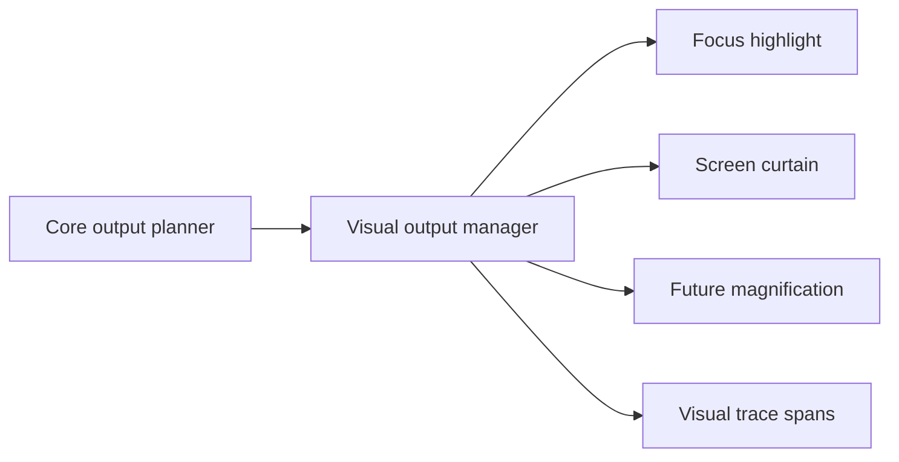

# Visual Output and Future Magnification

## Decision

Focus highlight and screen curtain are in scope before magnification. Magnification is also in scope, but it comes after braille display support. Earlier visual-output decisions must not prevent magnification.

## Visual Output Boundary

This diagram shows a shared visual output manager that can support current and future visual features.

## Rules

| Rule | Reason |
|---|---|
| Use stable node IDs and screen bounds from tree snapshots | Highlight and magnification need consistent target geometry |
| Keep visual effects outside provider call paths | Visual output must not block focus or speech |
| Keep screen curtain separate from magnification | Privacy and zoom are different policies |
| Trace visual updates | Debugging needs to explain highlight, curtain, and future magnification latency |
| Avoid hard-coding a one-effect compositor | Magnification will need more than focus rectangles |

## Phase Placement

| Feature | Phase |
|---|---:|
| Focus highlight | Before or during Phase 7 GUI/config work, when bounds are reliable |
| Screen curtain | Before or during Phase 7 GUI/config work, with secure-desktop policy |
| Braille displays | Phase 13 |
| Magnification | Phase 14, after braille |

## Acceptance Criteria

| Requirement | Check |
|---|---|
| Highlight does not block speech or input | Trace and latency test |
| Screen curtain policy is secure-desktop aware | Secure desktop scenario |
| Magnification is not architecturally blocked | Phase 14 pre-check against visual output manager |
