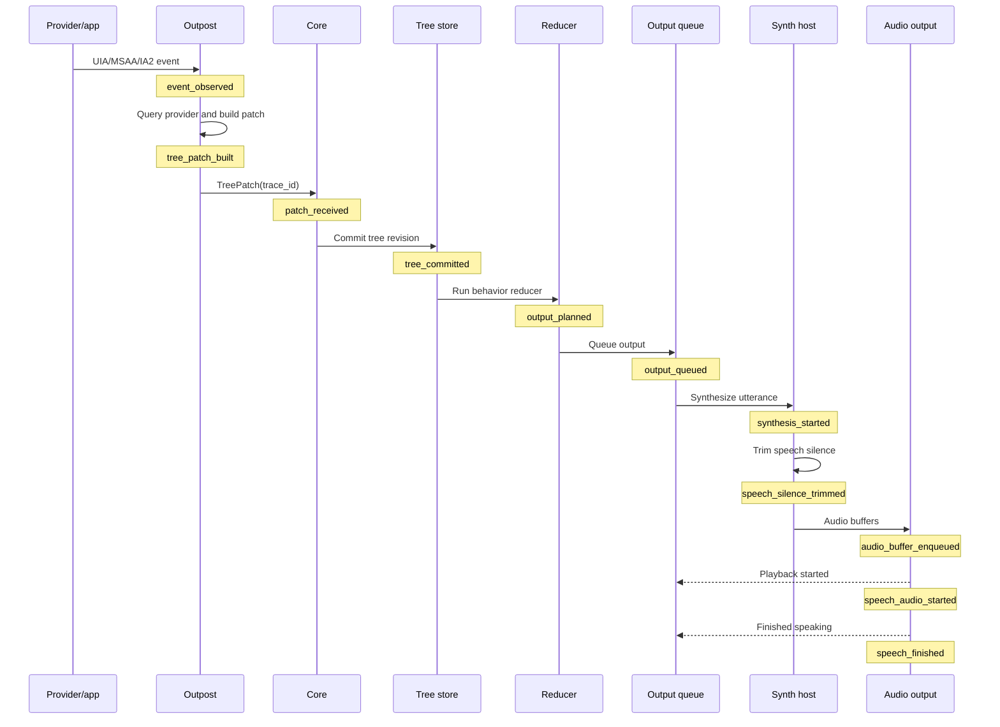

# Observability and Trace Schema

## Goal

It must be possible to explain latency and behavior for every important user-visible event. A developer should be able to answer:

| Question | Required evidence |
|---|---|
| When was the event observed? | Outpost or input span |
| When did it become part of the tree? | Tree commit span and revision |
| When did behavior planning run? | Reducer/output planning span |
| When was output queued? | Output queue span |
| When did synthesis, tone/cue rendering, audio playback, and output completion happen? | Synth, renderer, and audio spans |
| Was any work dropped, coalesced, timed out, or superseded? | Outcome fields and links |

## End-to-End Trace Flow

This diagram shows the required event-to-output trace path for speech. Tones and sound cues follow the same output queue and audio backend path without the synth step.

## Trace Identity

| Field | Description |
|---|---|
| `trace_id` | End-to-end causal event ID |
| `span_id` | Individual operation ID |
| `parent_span_id` | Direct causal parent |
| `causality` | `event`, `input`, `timer`, `extension`, `replay`, `recognition` |
| `source` | `uia`, `msaa`, `ia2`, `input`, `extension`, `ocr`, `ai`, `speech`, `tone`, `sound-cue`, `audio`, `braille`, `visual`, `remote` |
| `process_role` | `core`, `outpost`, `extension-host`, `synth-host`, `audio-engine`, `gui`, `tool` |
| `machine_id` | Local machine, VM, container, or remote peer identity for cross-machine traces |
| `session_id` | Verbatim session identity |
| `remote_peer_id` | Remote peer identity when a span crosses a remote transport |
| `target_pid` | Application/provider process when applicable |
| `outpost_id` | Outpost process identity |
| `audio_backend_id` | Selected audio backend, such as local WASAPI, remote, fake, spy, or secure |
| `audio_output_target` | Device ID, remote peer ID, or test sink name when applicable |
| `node_id` | Verbatim stable node ID if known |
| `tree_revision` | Snapshot revision after commit |
| `output_id` | Output item caused by this trace |
| `output_kind` | `speech`, `tone`, `sound-cue`, `braille`, `visual`, or `remote-command` |
| `utterance_id` | Speech item caused by this trace when `output_kind` is `speech` |
| `timestamp_qpc` | High-resolution monotonic timestamp |
| `timestamp_utc` | Wall-clock anchor for cross-process correlation |
| `duration_us` | Span duration |
| `deadline_us` | Deadline if one applied |
| `outcome` | `ok`, `timeout`, `cancelled`, `dropped`, `coalesced`, `superseded`, `stale`, `error` |

## Required Spans

| Span | Emitted by |
|---|---|
| `event_observed` | Outpost or input layer |
| `provider_query_started` | Outpost |
| `provider_query_finished` | Outpost |
| `tree_patch_built` | Outpost |
| `tree_patch_sent` | Outpost |
| `tree_patch_received` | Core |
| `tree_committed` | Tree store |
| `behavior_reducer_started` | Core |
| `behavior_reducer_finished` | Core |
| `output_planned` | Core |
| `output_queued` | Output scheduler |
| `speech_planned` | Core, when output kind is speech |
| `speech_queued` | Output scheduler, when output kind is speech |
| `synthesis_started` | Synth host |
| `synthesis_finished` | Synth host |
| `speech_silence_trimmed` | Synth host or speech post-processor |
| `tone_generated` | Tone renderer |
| `sound_cue_loaded` | Sound cue renderer |
| `audio_buffer_enqueued` | Audio output engine |
| `audio_buffer_dropped` | Audio output engine |
| `audio_command_sent` | Remote backend in command mode |
| `remote_output_acknowledged` | Remote backend or remote peer |
| `audio_backend_changed` | Audio output engine |
| `audio_backend_unavailable` | Audio output engine |
| `audio_device_changed` | Audio output engine |
| `audio_underrun` | Audio output engine |
| `speech_audio_started` | Audio output engine |
| `speech_interrupted` | Synth host or scheduler |
| `speech_finished` | Audio output engine |
| `tone_audio_started` | Audio output engine |
| `tone_finished` | Audio output engine |
| `sound_cue_audio_started` | Audio output engine |
| `sound_cue_finished` | Audio output engine |
| `braille_output_started` | Braille output engine |
| `braille_output_finished` | Braille output engine |
| `visual_update_started` | Visual output manager |
| `visual_update_finished` | Visual output manager |
| `visual_update_failed` | Visual output manager |
| `output_finished` | Output scheduler or output backend for every output kind |

## Latency Metrics

| Metric | Initial target or use |
|---|---|
| Event observed to tree commit | Measured in every phase |
| Tree commit to output queued | Contributor to the 20 ms focus-event-to-speech-start target and tone/cue responsiveness |
| Cacheable focus event observed to speech audio started | p95 under 20 ms on x64 and ARM64 |
| Output queued to first local audio buffer accepted | Low single-digit ms where practical |
| Output queued to first remote command or packet accepted | Measured per transport and remote scenario |
| Interrupt request to old speech stopped | p95 under 20 ms |
| Interrupt request to queued audio buffers dropped | p95 under 20 ms |
| Interrupt request to remote drop command sent | p95 under 20 ms |
| Local device invalidation to core notification | p95 under 100 ms |
| Provider query duration | Operation-specific deadline |
| Outpost restart duration | Tracked for recovery quality |

Speech duration itself is measured but is not usually a responsiveness failure unless interruption does not work.

Remote and VM traces use monotonic timestamps per machine plus UTC anchors and remote transport spans. Cross-machine reports must show the clock-correlation method and the uncertainty window rather than pretending QPC values are globally comparable.

## Output Formats

| Format | Use |
|---|---|
| NDJSON | Default machine-readable trace stream; newline-delimited JSON with one JSON object per line |
| Summary JSON | CI and VM latency reports |
| Benchmark JSON | Programmatic performance gate and trend data |
| Perfetto or Chrome trace | Timeline visualization |
| Markdown report | Human review and parity gates |

## Phase Gate

No phase is complete unless it produces:

| Artifact | Purpose |
|---|---|
| Trace file | Raw evidence |
| Latency summary | p50, p95, p99, timeout, drop, and coalescing counts |
| Benchmark report | Programmatic performance result for deterministic latency-sensitive paths |
| Parity report | NVDA comparison or documented divergence |
| Regression baseline | Stored metrics for future comparison |
