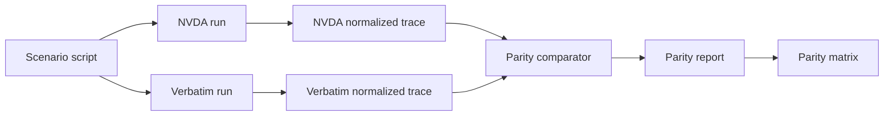

# NVDA Parity Strategy

## Goal

NVDA parity is a continuous engineering practice, not a late milestone. Every phase must update the parity matrix, add or refine scenarios, and produce a report showing what matches NVDA, what intentionally differs, and what remains missing.

## Parity Loop

This diagram shows differential testing between NVDA and Verbatim.

## Comparison Policy

| Behavior | Comparison type |
|---|---|
| Focus movement | Semantic equality |
| Role/name/state output | Semantic equality with allowed wording differences |
| Gesture binding | Exact where user-facing compatibility is expected |
| Speech order | Exact or explicitly improved |
| Timing | Verbatim should meet its latency budget; NVDA timing is baseline context |
| Browse/scan navigation | Semantic target equality |
| Secure desktop behavior | Security policy first, parity second |
| Extension/add-on behavior | Portability path, not binary compatibility |

## Parity Matrix Columns

| Column | Meaning |
|---|---|
| Feature | User-visible behavior or subsystem |
| NVDA source | Relevant NVDA file, doc, or scenario |
| Verbatim phase | Phase where work begins |
| Status | `missing`, `partial`, `parity`, `improved`, `intentional-divergence` |
| Required scenarios | Scenario IDs that exercise the feature |
| Trace evidence | Latest trace/report artifact |
| Divergence rationale | Required when status is `improved` or `intentional-divergence` |

## Initial Feature Map

| Feature | Phase | Initial status | Notes |
|---|---:|---|---|
| Focus speech for Windows shell | 2 | missing | First real UIA reader milestone |
| Keyboard gesture dispatch | 1 | missing | Core behavior before providers |
| Speech interruption | 1 | missing | Required for responsiveness |
| Review cursor/object navigation | 1-2 | missing | Starts with fake tree tests |
| Terminal output handling | 3 | missing | Must beat NVDA responsiveness baseline |
| Wasm app extensions | 4 | missing | Replacement for app modules |
| OneCore synthesizer | 2 | missing | First real synthesizer target through isolated synth host |
| SAPI5 and eSpeak synthesizers | 5 | missing | Later synth expansion |
| Native DLL synth path | 5 | missing | Native host proof of concept |
| Browser browse mode | 6 | missing | Incremental render required |
| Configuration profiles | 7 | missing | GUI and profile behavior |
| Localization and dictionaries | 7 | missing | Multilingual from the start |
| Remote support | 8 | missing | Shared substrate with separate dev and user profiles |
| OCR recognition | 9 | missing | Current object, region, window, and rerun on update |
| AI synthetic trees | 10 | missing | Synthetic accessibility tree and rerun on screen changes |
| Office rich text and tables | 11 | missing | Heavy app-specific support |
| Java Access Bridge | 12 | missing | Deferred backend |
| Braille display hardware | 13 | missing | Deferred due to hardware availability |
| Magnification | 14 | missing | Supported after braille |

## Scenario Catalog

Scenario IDs should be stable. The first catalog should include:

| Scenario ID | Phase | Description |
|---|---:|---|
| `shell.focus.start-menu` | 2 | Open Start and move focus through pinned/search results |
| `shell.focus.settings` | 2 | Navigate Windows Settings categories and controls |
| `terminal.output.burst` | 3 | Produce high-volume terminal output and measure speech behavior |
| `terminal.caret.prompt` | 3 | Move through prompt, command, and output history |
| `browser.large-page.initial-nav` | 6 | Begin navigation before full page indexing completes |
| `browser.forms.basic` | 6 | Navigate form fields and state changes |
| `secure.uac.focus` | 2 | Speak UAC focus without loading normal user extensions |
| `secure.extension.allowlisted` | 4 | Load an explicitly secure-allowlisted Wasm extension with reduced capabilities |
| `remote.command.speech` | 8 | Speak through remote output command mode |
| `remote.dev.collect-trace` | 0 | Collect VM/container trace artifacts through the dev automation profile |
| `ocr.focused-object` | 9 | Trigger OCR on the focused object |
| `ocr.region.rerun` | 9 | Rerun OCR after a recognized region changes |
| `ai.synthetic-tree.rerun` | 10 | Rerun AI recognition after screen contents change |
| `office.word.table-nav` | 11 | Navigate Word table cells and text |

## Phase Gate

A phase is complete only when:

| Gate | Requirement |
|---|---|
| Matrix update | All phase features have current status |
| Scenario run | Required scenarios pass or have documented failures |
| Trace evidence | Artifacts link event, tree, and speech spans |
| Divergence review | Intentional differences are documented |
| Regression baseline | Metrics are saved for future comparison |
