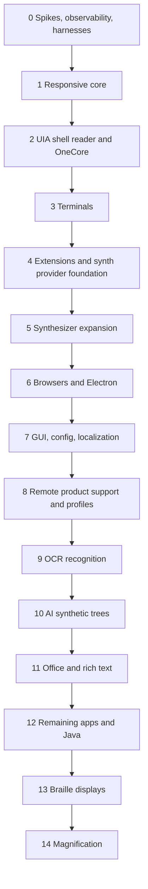

# Phase Roadmap

## Goal

Each phase must produce a minimal usable reader capability or an independently testable subsystem. Architecture-only phases are not acceptable. Observability, parity reporting, and test artifacts are required in every phase.

## Phase Dependency Graph

## Universal Phase Gates

| Gate | Requirement |
|---|---|
| Build | x64 and ARM64 Windows targets build |
| ARM64 runtime | Scheduled or release-gate ARM64 hardware/VM/self-hosted run reports latency-sensitive benchmarks |
| Format | `cargo fmt --all -- --check` |
| Lint | `cargo clippy --workspace --all-targets --all-features -- -D warnings` |
| Tests | `cargo test --workspace --all-features` |
| Benchmarks | Programmatic benchmark report exists for the phase's latency-sensitive paths |
| Observability | Trace artifacts and latency summary exist |
| Parity | Parity matrix and scenario report updated |
| Docs | Phase spec and architecture docs updated |

## Phase 0: Spikes, Observability, and Harnesses

| Area | Deliverable |
|---|---|
| Rust workspace | Initial crates, GitHub Actions CI, x64 and ARM64 build targets |
| COM spikes | MTA UIA lane and STA MSAA/IA2 lane experiments |
| Outpost spike | Core can request provider data through an isolated process |
| Audio spike | Backend abstraction plus local WASAPI endpoint enumeration, render-buffer playback, and device notifications |
| Remote substrate spike | Dev-only minimum protocol for session framing, capabilities, trace IDs, and VM/container tooling |
| Benchmark harness | Programmatic benchmark runner for tree commits, reducers, IPC, output scheduling, fake synth, and fake audio paths |
| Fake providers | UIA/MSAA/IA2 fixture applications |
| Hung provider | Fixture that blocks selected calls |
| Trace schema | Event-to-tree-to-output trace can be represented |
| Query tools | Initial accessibility inspect and event capture CLIs |
| GitHub runner lab | Windows-hosted CI can run fake-provider, replay, IPC, and benchmark scenarios without a VM |
| Windows container spike | Determine whether Docker Windows containers can run useful headless fixture, IPC, replay, and benchmark scenarios |
| VM/container lab | Script skeleton can run one scenario and collect artifacts through the dev automation profile |
| Parity | Initial NVDA feature map and first baseline trace |

Acceptance: one fake focus event can be observed, represented as a tree patch, committed, planned into output, traced through queued speech and audio completion, and measured by the benchmark harness. The GitHub Actions workflow runs hosted Windows runner checks, and the Windows container spike records whether containers are useful for CI or should be limited to local/dev lab work.

## Phase 1: Responsive Core

| Area | Deliverable |
|---|---|
| Tree store | Applies validated patches and exposes immutable revisions |
| Reducers | Focus, review cursor, object navigation, and output intent |
| Locale metadata | Tree nodes, text runs, output intents, and traces carry language/locale hints before user-facing localization is complete |
| Input gestures | Keyboard gesture abstraction and dispatch |
| Output scheduler | Interrupt, queue, priority, speech, tones, sound cues, and spy sinks |
| Audio sinks | Fake and spy audio sinks plus audio trace spans |
| Silence trimming | Speech audio post-processing path trims leading/trailing silence before backend enqueue |
| Replay tests | Behavior tests from generated traces |
| Benchmarks | Programmatic p50/p95/p99 checks for reducer, output queue, and focus-event-to-speech-start latency |
| Observability | p95 reports for input-to-speech-start path |

Acceptance: Verbatim can run against fake trees and produce deterministic speech, tones, and sound cues through spy sinks while meeting the p95 under 20 ms cacheable focus-event-to-speech-audio-started target in the harness.

## Phase 2: UIA Shell Reader and OneCore

| Area | Deliverable |
|---|---|
| UIA outpost | Real UIA event subscriptions and queries |
| Shell scenarios | Start, Settings, Explorer, desktop, taskbar |
| Secure desktop prototype | Restricted secure mode smoke path with deny-by-default extension policy |
| Minimal synth host IPC | Supervised synth process, low-latency command stream, render status, and crash handling |
| OneCore synthesizer | First real synthesizer target, running in the isolated synth host rather than the core |
| Local audio backend | Minimal real WASAPI playback for shell-reader usage |
| Stale cache behavior | Speak cached focus when provider is slow |
| Parity | NVDA comparison for shell focus speech |

Acceptance: Verbatim is minimally usable for Windows shell navigation with OneCore speech through the isolated synth host and remains responsive if the shell outpost, synth host, or a provider blocks. Secure desktop loads no normal user extensions by default.

## Phase 3: Terminals

| Area | Deliverable |
|---|---|
| Windows Terminal support | Focus, caret, prompt, output reading |
| UIA throttling | Coalesce excessive terminal events |
| Remote Operations experiments | Batch terminal/text queries where useful |
| Burst scenarios | High-output stress tests |
| Latency reports | Compare against NVDA baseline |

Acceptance: terminal burst output does not hang the reader, stale output is superseded correctly, and command prompt interaction remains responsive.

## Phase 4: Extensions and Synth Provider Foundation

| Area | Deliverable |
|---|---|
| Wasm extension MVP | Capability-scoped app extension host |
| Host APIs | Tree query, event subscription, speech/tone/cue requests, config, storage |
| Secure extension policy | Per-extension secure-desktop allowlist and reduced capability grants |
| Synth extension contract | Versioned synth-provider API for extension-provided, SAPI5, eSpeak, and native-DLL synth paths |
| Audio engine integration | Additional synth providers stream through the Phase 2 audio output path |
| Extension traces | Extension decisions visible in trace artifacts |

Acceptance: a minimal app extension can alter output behavior from snapshot data, synth host crashes do not crash the core, extension-originated speech/tones/cues are traceable, and a secure-allowlisted Wasm extension can load on secure desktop while non-allowlisted extensions are denied.

## Phase 5: Synthesizer Expansion

| Area | Deliverable |
|---|---|
| SAPI5 synthesizer | Standard Windows SAPI5 support |
| eSpeak synthesizer | eSpeak support with multilingual validation |
| Native DLL synth path | Controlled native DLL loading in an isolated synth host |
| Pure Wasm synth path | Feasibility path for synths that can run safely in Wasm |
| Voice settings | Rate, pitch, volume, language, voice selection, and profile integration |
| Latency tests | Compare synth queue, render, trim, and backend enqueue timings |

Acceptance: OneCore remains the first target, SAPI5 and eSpeak are supported, and native DLL synth support is isolated and measurable without loading third-party DLLs into the core.

## Phase 6: Browsers and Electron

| Area | Deliverable |
|---|---|
| IA2/MSAA web support | Browser provider adapters |
| Incremental browse mode | Interaction before full document render completes |
| Large page handling | Partial indexing, stale work cancellation, progressive navigation |
| Electron apps | Initial VS Code or similar scenario |
| Parity | Browser scenario comparison with NVDA |

Acceptance: a large page can be opened and navigated before full indexing completes, with trace evidence for partial render and output timing.

## Phase 7: GUI, Config, and Localization

| Area | Deliverable |
|---|---|
| wxDragon GUI | Accessible settings and diagnostics UI |
| Configuration profiles | App/profile activation and storage |
| Localization | Multilingual resource strategy |
| Dictionaries | Pronunciation and symbol dictionaries |
| Output settings | Audio backend, synthesizer, tones, sound cues, and visual output settings |
| User-facing diagnostics | Trace and parity artifact browsing from GUI where useful |

Acceptance: the reader's own GUI is accessible, profile changes affect behavior, and localization/dictionary/output settings work in tests.

## Phase 8: Remote Product Support and Profiles

| Area | Deliverable |
|---|---|
| Shared remote substrate hardening | Production versioning, authentication hooks, heartbeat, reconnect, relay-friendly transport, and trace propagation |
| Profile separation audit | Prove the Phase 0 dev automation profile and user remote profile cannot access each other's capabilities |
| User remote profile | Pairing, consent, remote control, and remote output policy |
| Output command mode | Remote speech, tones, sound cues, priority, and interruption commands |
| Audio stream mode | Optional remote audio backend for exact audio transport |
| Security policy | Secure desktop and privileged scenarios are restricted |

Acceptance: the Phase 0 VM/container tooling continues to use the dev automation profile, user-facing remote support uses a separate consent-driven profile, dev-only tree/provider/artifact capabilities are denied to the user profile, and command-mode remote output works for speech, tones, and sound cues.

## Phase 9: OCR Recognition

| Area | Deliverable |
|---|---|
| OCR API | Extension-triggered OCR for focused object, selected region, or current window |
| OCR model providers | Extensions can contribute OCR models/providers with explicit capabilities |
| Recognition result view | Review/browse-style navigation over recognized text |
| Rerun on update | Re-capture and rerun OCR when the target object, region, or window updates |
| Provider invalidation | Focus, bounds, and provider events invalidate stale OCR results |
| Observability | Capture, OCR, rerun, result, and output traceable end to end |

Acceptance: Verbatim can run OCR on the focused object, a region, or the current window, present the recognized text for navigation, rerun OCR when the target updates, and load an explicitly permitted extension-contributed OCR model/provider.

## Phase 10: AI Synthetic Trees

| Area | Deliverable |
|---|---|
| AI recognition broker | Controlled model invocation path for screen recognition |
| AI model providers | Extensions can contribute AI recognition models/providers with explicit capabilities |
| Synthetic tree generation | Nodes with role, name, bounds, relations, confidence, and provenance |
| Synthetic tree patches | Incremental patches when recognition reruns after screen changes |
| Provider merge | Synthetic nodes coexist with provider nodes without hiding provenance |
| Scan projections | Scan-mode-like navigation over synthetic trees |
| Observability | Capture, model call, synthetic patch, rerun, and output traceable end to end |

Acceptance: AI recognition can synthesize an accessibility tree, rerun when the screen changes, update generated nodes without confusing them with provider nodes, and load an explicitly permitted extension-contributed AI recognition model/provider.

## Phase 11: Office and Rich Text

| Area | Deliverable |
|---|---|
| Office app extensions | Word, Excel, Outlook, PowerPoint priority order based on traces |
| Rich text | Advanced text ranges, formatting, caret, selection |
| Tables | Row/column navigation and speech |
| Parity | Scenario packs derived from NVDA behavior |

Acceptance: priority Office scenarios have parity or documented improvement, with rich text and table behavior covered by replay and VM tests.

## Phase 12: Remaining Apps and Java

| Area | Deliverable |
|---|---|
| Common apps | Adobe and other high-value app support |
| Java Access Bridge | Deferred backend in outpost model |
| Compatibility expansion | More scenario packs and extension APIs as justified |
| Parity | Broader matrix coverage |

Acceptance: Java Access Bridge follows the same isolation, tracing, and parity rules as other backends.

## Phase 13: Braille Displays

| Area | Deliverable |
|---|---|
| Braille output pipeline | Connect existing output intents to braille |
| Display drivers | Hardware-specific support |
| Input gestures | Braille display command input |
| Hardware validation | Real-device tests when hardware is available |

Acceptance: supported braille displays can output focus/review/browse content and send gestures through the same input abstraction.

## Phase 14: Magnification

| Area | Deliverable |
|---|---|
| Magnification architecture validation | Confirm earlier visual output decisions support magnification |
| Magnification output manager | Zoom and viewport control layered beside highlight and screen curtain |
| Configuration | Magnification settings and profile behavior |
| Observability | Trace visual update latency and failures |

Acceptance: magnification works without changing the tree, output, or visual manager architecture in ways that regress speech, braille, highlight, or screen curtain.
