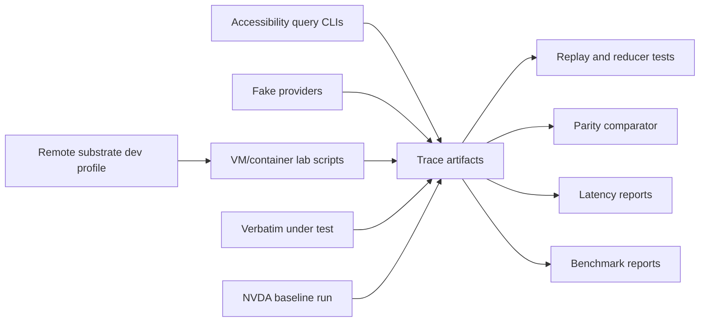
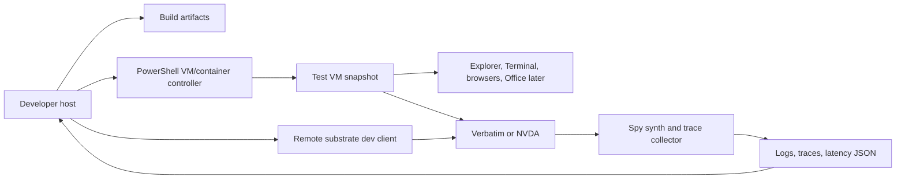

# Developer Tooling and VM Lab

## Goal

Developer tooling is a first-class part of the rewrite. Verbatim must be easy for humans and LLM agents to inspect, test, trace, and compare against NVDA.

Phase 0 must produce observability and tooling before major reader behavior accumulates.

GitHub Actions CI is tracked as a Phase 0 deliverable. The initial workflow should run the universal phase gates: formatting, clippy with warnings denied, workspace tests, x64 Windows build, ARM64 Windows build, and deterministic benchmark checks.

## Tooling Topology

This diagram shows how tools feed both development and CI evidence.



## CI Lab Tiers

The tooling should prefer tests that run on GitHub-hosted Windows runners, then fall back to containers or VMs only when the scenario requires them.

| Tier | Environment | Intended checks | Limits |
|---|---|---|---|
| Hosted Windows runner | GitHub Actions Windows runner | Rust checks, fake providers, replay tests, outpost IPC, deterministic benchmarks, trace report generation | Not full Windows 11 desktop fidelity for all x64 scenarios |
| Windows container spike | Docker Windows container launched from a Windows runner or developer host | Headless fixture providers, IPC/replay benchmarks, tool smoke tests, trace artifact collection | May not support interactive desktop, shell, audio device, or real app accessibility scenarios |
| VM lab | Windows 11 x64 or Windows 11 ARM VM with desktop session | Explorer, Terminal, browsers, Office, NVDA baseline, secure desktop-adjacent/manual scenarios | Slower and more operationally complex |
| Self-hosted runner | Controlled Windows 11 x64 or ARM64 machine/VM | Full-fidelity scheduled or release gates when GitHub-hosted runners are insufficient, including ARM64 runtime latency reports | Requires maintenance and hardening |

## Benchmarks

Benchmarks are required because latency is a product requirement, not just an implementation detail. The benchmark runner should emit machine-readable JSON plus trace artifacts, and CI should fail only on deterministic checks with stable budgets. Noisy real-app or VM benchmarks should be reported first, then promoted to gates after they are stable.

| Benchmark area | Early scenario | CI expectation |
|---|---|---|
| Tree store | Apply representative patch batches and publish immutable revisions | Hosted Windows runner gate |
| Reducers | Focus, review, browse/scan projection, and output intent planning from fixed snapshots | Hosted Windows runner gate |
| Outpost IPC | Core-to-outpost request/response with fake providers and timeout paths | Hosted Windows runner gate |
| Event pipeline | Fake provider focus event to tree commit to speech audio started | Hosted Windows runner gate |
| Extension host | Wasm call overhead, deadline handling, and output request path | Phase 4 hosted runner gate |
| Synth/audio fake path | Fake synth, silence trimming, output queue, fake/spy audio sink | Hosted Windows runner gate |
| Local WASAPI | Buffer enqueue and device notification behavior | Windows runner or VM report, promoted only if stable |
| Real apps | Terminal bursts, browser large pages, Office rich text | VM or self-hosted scheduled report |

Benchmark outputs should include p50, p95, p99, max, timeout count, dropped/coalesced count, build target, CPU architecture, runner identity, and whether the result was a gate or an informational report.

ARM64 first-class support requires runtime evidence, not only compilation. Hosted CI must always build ARM64; scheduled or release-gate runs must execute the deterministic benchmark suite on Windows 11 ARM64 hardware, an ARM64 VM, or a maintained ARM64 self-hosted runner. At minimum those runs cover input dispatch, tree commit, outpost IPC, fake synth/audio, and a real shell scenario when a desktop session is available.

## Accessibility Query Tools

The query tools should be Rust binaries in the workspace. PowerShell scripts should orchestrate them, not own parsing or COM logic.

| Tool | Purpose |
|---|---|
| `verbatim-a11y-inspect.exe` | Inspect focus, window, subtree, text range, patterns, states, and provider identity |
| `verbatim-a11y-events.exe` | Subscribe to UIA/MSAA/IA2 event streams and emit normalized NDJSON, meaning one JSON object per line |
| `verbatim-a11y-replay.exe` | Replay captured traces into the core reducer |
| `verbatim-a11y-diff.exe` | Compare two normalized traces |
| `verbatim-audio-inspect.exe` | Enumerate output backends/devices and report current audio engine status |
| `verbatim-remote-dev.exe` | Connect to a VM/container instance through the dev automation profile |
| `Get-VerbatimA11ySnapshot.ps1` | LLM-friendly wrapper around inspect |
| `Start-VerbatimA11yTrace.ps1` | Wrapper to start event capture with standard fields |

Example CLI shapes:

```powershell
verbatim-a11y-inspect.exe --backend uia --focus --json
verbatim-a11y-inspect.exe --backend msaa --hwnd 0x00123456 --subtree --depth 3 --json
verbatim-a11y-events.exe --backend uia --focus --duration-ms 5000 --out traces\focus.ndjson
verbatim-a11y-replay.exe --trace traces\focus.ndjson --assert traces\focus.expected.json
verbatim-audio-inspect.exe --json
verbatim-remote-dev.exe collect-artifacts --target vm:verbatim-dev --out artifacts\latest
```

## Fake Providers

| Fixture | Purpose |
|---|---|
| UIA fixture provider | Custom UIA tree and event source for adapter tests |
| MSAA fixture provider | `WM_GETOBJECT` path and IAccessible behavior |
| IA2 fixture provider | IA2 interfaces layered on MSAA-style objects |
| Hung provider | Blocks selected calls to prove outpost isolation |
| Burst provider | Emits high-volume changes for throttling tests |
| Text provider | Exercises text ranges, caret, selection, and formatting |

Fixtures must run in both x64 and ARM64 builds where possible. Cross-architecture behavior should be explicit when a provider or synth is only available in one architecture.

## VM and Container Lab

The VM and container lab automates real application testing and inspection. It should use the shared remote substrate's dev automation profile for scenario control, trace collection, tree inspection, and artifact retrieval.



## VM Scripts

| Script | Responsibility |
|---|---|
| `New-VerbatimVm.ps1` | Create or register a test VM |
| `Reset-VerbatimVm.ps1` | Restore a clean snapshot |
| `Copy-VerbatimBuildToVm.ps1` | Copy build artifacts into the VM |
| `Invoke-VerbatimVmScenario.ps1` | Run a named scenario and collect artifacts |
| `Invoke-VerbatimNvdaBaseline.ps1` | Run the same scenario under NVDA |
| `Get-VerbatimVmArtifacts.ps1` | Pull traces, logs, screenshots when useful, and summaries |
| `Invoke-VerbatimRemoteDev.ps1` | Wrapper for dev-profile remote inspection and artifact collection |

## Windows Container Spike

Docker Windows containers should be investigated in Phase 0, but the architecture must not depend on them until the spike proves useful behavior. The spike should answer:

| Question | Required result |
|---|---|
| Can GitHub-hosted Windows runners launch a compatible Windows container for this repository? | CI log plus image/version details |
| Can a container run fake UIA/MSAA/IA2 provider fixtures and query tools? | Passing smoke test or documented blocker |
| Can a container run outpost IPC, replay, and benchmark harnesses reliably? | Benchmark JSON and trace artifact |
| Can a container expose any useful accessibility events without an interactive desktop? | Evidence from trace capture |
| What cannot run in containers? | Explicit list, expected to include full shell, real desktop apps, and audio device scenarios unless proven otherwise |

If containers work, they become a cheaper CI isolation tier for headless tests. If they do not, the same scripts should keep working against hosted runners and VMs through the remote dev profile.

## Acceptance Criteria

| Phase 0 deliverable | Check |
|---|---|
| Query CLI skeleton | Can inspect focused UIA object as JSON |
| Event recorder | Can capture focus events as NDJSON |
| Audio inspector | Can enumerate output backends/devices and emit JSON status |
| Remote dev profile | Can collect a trace artifact from a VM/container instance |
| Benchmark runner | Can emit benchmark JSON for fake event-to-output and IPC paths |
| Replay tool | Can feed a trace into a test reducer |
| Fake UIA provider | Can expose a scripted tree and focus event |
| Hung provider | Can prove core timeout behavior |
| GitHub Windows runner path | Can run fake-provider, replay, IPC, and benchmark checks without a VM |
| Windows container spike | Records whether Docker Windows containers are usable for headless CI checks |
| VM skeleton | Can start a VM scenario and collect one artifact |
| NVDA baseline path | Can capture a normalized trace from one NVDA scenario |
